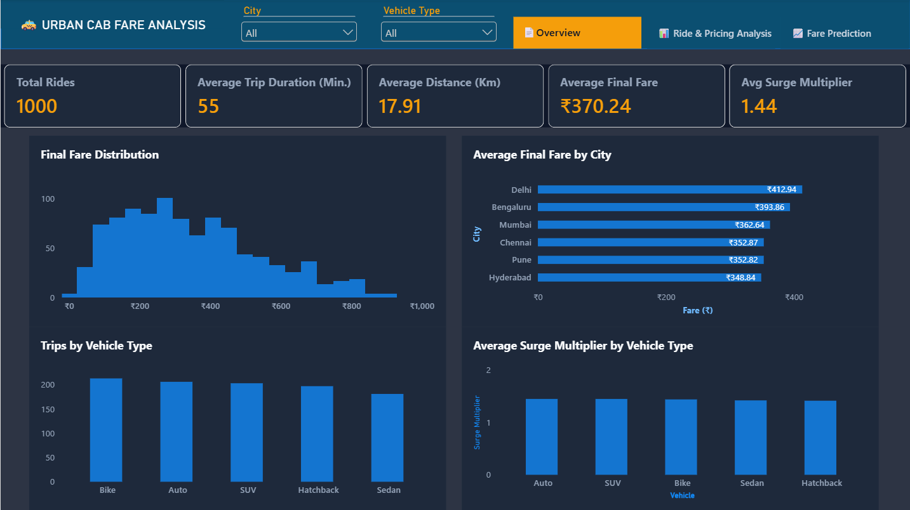

# 🚕 Urban Cab Fare Analysis & Prediction

An end-to-end **Data Analytics + Machine Learning + Power BI** project for analyzing urban cab fares, understanding pricing patterns, and predicting final ride fares using a **Linear Regression** model.

## 📌 Project Overview

The project combines exploratory data analysis, machine learning, model evaluation, and an interactive Power BI dashboard.

### Objectives

- Analyze cab fare patterns across Indian cities and vehicle types.
- Understand how distance, trip duration, and surge multiplier affect final fare.
- Build a machine learning model to predict final cab fare.
- Evaluate the model using R², MAE, and RMSE.
- Reproduce the trained model's prediction logic inside Power BI for interactive predictions.

---

## 📊 Dataset

**Dataset:** Urban Cab Fare / Surge Pricing in Indian Cities

The dataset contains **1,000 ride records**.

| Feature | Description |
|---|---|
| `City` | City where the ride occurred |
| `Vehicle_Type` / `Type_of_vehicle` | Vehicle type |
| `Distance_km` | Ride distance in kilometres |
| `Trip_Duration` | Trip duration |
| `Surge_Multiplier` | Surge pricing multiplier |
| `Final_Fare` | Final fare charged |

Data preparation included inspection of data types, missing values, categorical values, and numerical ranges. Two missing name-related values were handled as `Unknown`.

---

## 🧹 Data Preparation

1. Load the dataset using Pandas.
2. Inspect data types and missing values.
3. Handle missing/inconsistent values.
4. Separate features and target.
5. Split the data into training and testing sets.
6. Apply **One-Hot Encoding** to categorical features.

The fare model uses an **80/20 train-test split** with `random_state=42`.

---

## 🤖 Machine Learning

### Fare Prediction

A **Linear Regression** model predicts `Final_Fare` from:

- City
- Vehicle Type
- Distance
- Trip Duration
- Surge Multiplier

### Pipeline

```text
Raw Features
     ↓
One-Hot Encoding
     ↓
Numerical Features
     ↓
Linear Regression
     ↓
Predicted Final Fare
```

### Model Performance

| Metric | Result |
|---|---:|
| R² | **0.9570** |
| MAE | **₹30.27** |
| RMSE | **₹40.17** |

The model explains approximately **95.7% of the variance in the held-out test-set fares**.

> These are test-set evaluation results and are not a guarantee of production performance.

---

## 🧮 Regression Equation

The trained Linear Regression model can be represented as:

```text
Predicted Fare =
-309.3335
+ City Coefficient
+ Vehicle Coefficient
+ 16.9655 × Distance
+ 0.18181 × Trip Duration
+ 255.3477 × Surge Multiplier
```

### Numerical coefficients

| Feature | Coefficient |
|---|---:|
| Distance (km) | +16.9655 |
| Trip Duration | +0.18181 |
| Surge Multiplier | +255.3477 |

The model also contains categorical coefficients for each city and vehicle type.

---

## 🔬 Surge Multiplier Analysis

A separate attempt was made to predict `Surge_Multiplier` using both regression and multiclass classification.

The available features did not provide sufficient predictive signal for a useful surge prediction model. Therefore, the final dashboard treats **Surge Multiplier as a known input to fare prediction**, rather than predicting surge first.

---

## 📈 Power BI Dashboard

The Power BI report contains three main pages.

### 1. 🚕 Cab Fare Overview

Includes:

- Total Rides
- Average Trip Duration
- Average Distance
- Average Final Fare
- Average Surge Multiplier
- Final Fare Distribution
- Average Fare by City
- Trips by Vehicle Type
- Average Surge Multiplier by Vehicle Type

### 2. 📊 Ride & Pricing Analysis

Includes:

- Final Fare vs Distance
- Surge Multiplier vs Final Fare
- Average Fare per KM by Vehicle Type
- Average Surge Multiplier by City

### 3. 🤖 Fare Regression & Prediction

An interactive ML prediction interface where users select:

- City
- Vehicle Type
- Distance
- Trip Duration
- Surge Multiplier

The page displays:

- **Predicted Fare**
- **R²**
- **MAE**
- **RMSE**
- **Predicted Fare vs Distance** model-behavior curve
- **Regression Equation**

---

## 🔗 Python → Power BI Integration

The machine learning model was trained in Python and saved as a `.pkl` model artifact.

Power BI does not directly execute the Python `.pkl` model inside a standard DAX measure for this interactive prediction interface. Therefore, the trained model coefficients were extracted and reproduced in **DAX**.

This allows Power BI to provide interactive predictions while preserving the mathematical behavior of the trained Linear Regression model.

### Validation Example

For:

```text
City             = Mumbai
Vehicle Type     = SUV
Distance         = 10 km
Trip Duration    = 60 min
Surge Multiplier = 1.5
```

The Python model predicts approximately:

```text
₹307.76
```

The Power BI DAX implementation produces the same prediction to rounding precision.

---

## 📏 Prediction Range

The training data contains distances approximately between:

```text
1.01 km → 34.99 km
```

The prediction interface and model-behavior curve are kept within this observed training range. Predictions outside it would represent **extrapolation**.

---

## 🛠️ Tech Stack

### Data & ML
- Python
- Pandas
- NumPy
- Scikit-learn
- Jupyter Notebook

### Machine Learning
- Linear Regression
- One-Hot Encoding
- Train/Test Split
- R²
- MAE
- RMSE

### Business Intelligence
- Microsoft Power BI
- DAX
- Interactive slicers
- Page navigation

---

## 📁 Project Structure

```text
Cab_Price_Analysis/
│
├── data/
│   └── UrbanCabFare.csv
│
├── notebooks/
│   └── cab_fare_regression.ipynb
│
├── models/
│   └── fare_model.pkl
│
├── powerbi/
│   └── Urban_Cab_Fare_Analysis.pbix
│
├── images/
│   ├── overview.png
│   ├── ride-pricing-analysis.png
│   └── fare-prediction.png
│
├── README.md
└── requirements.txt
```

---

## 📷 Dashboard Preview


### Overview


### Ride & Pricing Analysis


### Fare Regression & Prediction


---

## 💡 Key Takeaways

- Distance and trip duration show strong relationships with final fare.
- Surge multiplier has a substantial effect in the trained fare regression model.
- The Linear Regression model achieved **R² = 0.9570** on the held-out test set.
- Mean Absolute Error was approximately **₹30.27**.
- Surge multiplier could not be reliably predicted from the available features, so it is treated as a known input for fare prediction.
- Power BI provides an interactive interface for applying the trained model's regression logic.

---

## 🚀 Future Improvements

- Test Random Forest, XGBoost, or LightGBM models.
- Add cross-validation and hyperparameter tuning.
- Deploy the model through FastAPI or Flask.
- Connect Power BI to a deployed ML API.
- Add prediction intervals.
- Add additional ride-level features when available.
- Monitor model performance on new data.

---

## 👤 Author

**Rajas Bhingarde**

GitHub: [Er-Rajas](https://github.com/Er-Rajas)

Interests: Data Science, Machine Learning, AI & Analytics

---

### Project Pipeline

**Data Analysis → Machine Learning → Model Evaluation → Power BI → Interactive Prediction**
